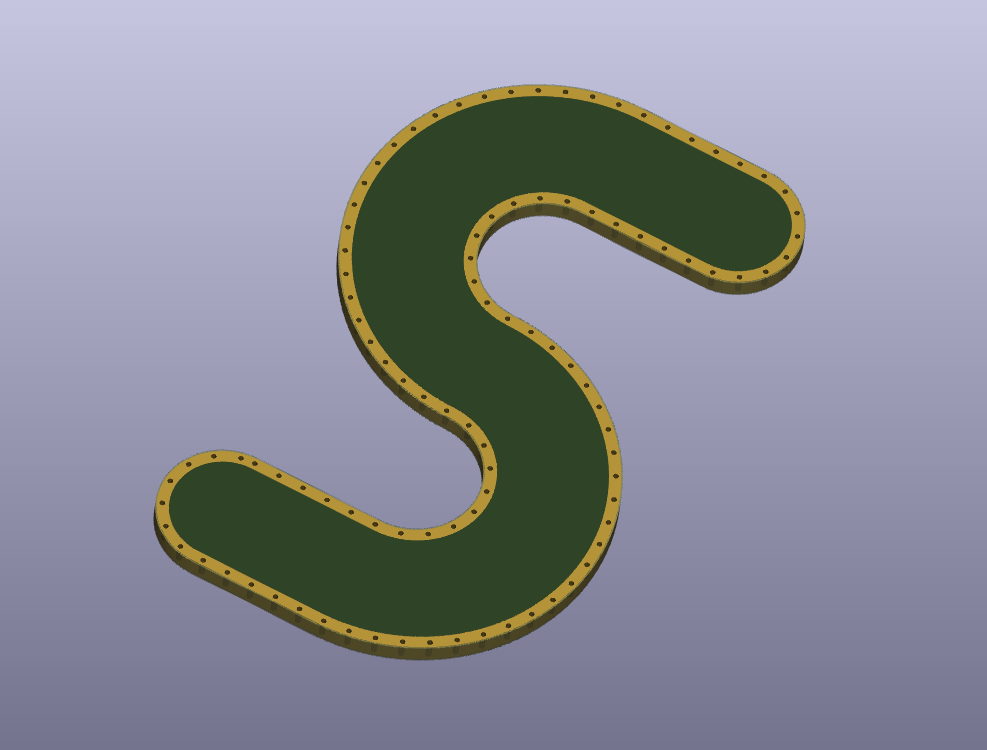

# Vias Along Path - KiCAD Plugin

Vias Along Path is a KiCAD plugin to create vias along a set of graphical lines or arcs. The following parameters can be set by the user:

- Via distance
- Via size (size of the annular ring)
- Drill size
- Net the via is attached to

## Example

In this example I drew the pcb outline using KiCAD and exported the outline as .dxf file using the File -> Plot option. I then used the offset tool of LibreCAD to generate the soldermask path with an distance of 0.5 mm. Next I imported the DXF file to KiCAD with an line width of 1 mm to the soldermask layer. Last we can generate the vias along the soldermask path using this plugin resulting in an pcb as shown in the screenshot.
